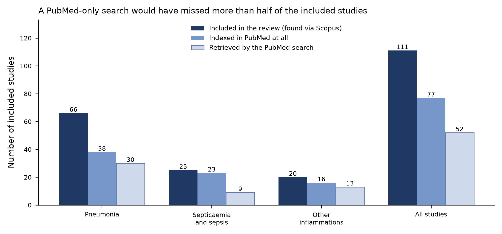

# Melioidosis-AI-SLR

Data deposit for the systematic review **"AI for Clinical Management of Melioidosis: A Systematic Review of Transferable Methodologies from Pneumonia, Sepsis, and Inflammatory Conditions"**.

Because melioidosis-specific AI studies are scarce, the review surveys AI and machine-learning methods developed for clinically analogous ("isomorphic") conditions — pneumonia, septicemia and sepsis, and other bacterial inflammations such as abscesses, ulcers, and mycotic aneurysms — and assesses how those methods might transfer to melioidosis care. This repository holds everything needed to verify the review's counts, tables, and appraisal: the full data-extraction dataset for all 111 included studies, the completed PRISMA 2020 checklist, and an empirical PubMed recall check prepared in response to peer review.

No analysis code was generated by the review; all syntheses are narrative and tabular.

---

## Repository contents

| File | Description |
|---|---|
| [`Data_Extraction_Melioidosis_AI_SLR.xlsx`](Data_Extraction_Melioidosis_AI_SLR.xlsx) | Complete extraction dataset (v2, R1 revision): per-study extraction fields, quality ratings, summary tables, search strings, and PRISMA flow counts. |
| [`PRISMA Checklist_AI_Melioidosis_SLR.pdf`](PRISMA%20Checklist_AI_Melioidosis_SLR.pdf) | PRISMA 2020 main checklist and PRISMA 2020 for Abstracts checklist, with the manuscript location of each item. |
| [`PubMed_Recall_Check.xlsx`](PubMed_Recall_Check.xlsx) | Empirical test of how many included studies a PubMed-only search would have retrieved, plus the novel PubMed records not in the review. |
| [`pubmed_recall_check.png`](pubmed_recall_check.png) | Figure summarizing the PubMed recall check by clinical category. |

---

## Data extraction workbook

`Data_Extraction_Melioidosis_AI_SLR.xlsx` was consolidated and de-duplicated from the authors' working extraction workbook. Each included study has a stable `Study_ID` (`S001`–`S111`) and the BibTeX `Citation_Key` used in the manuscript, so any statement in the text can be traced back to its extraction row.

| Sheet | Contents | Manuscript reference |
|---|---|---|
| `README` | Field-by-field description of the workbook, quality-domain definitions, and conventions. | — |
| `Included_Studies` | One row per included study (111 rows, 32 fields). | Section 3, Figures 2–3 |
| `Quality_Assessment` | Per-study ratings on three appraisal dimensions (D1–D3). | Section 2.1, Table 3 |
| `Table_Quality_Summary` | Aggregated appraisal results by category. | Table 3 |
| `Table_Performance_Summary` | Reporting frequency and median [IQR] of each performance metric by category. | Table 4 |
| `Search_Strategy` | The five Scopus search strings verbatim, with field tags, limits, and record counts. | Table 2 |
| `PRISMA_Flow` | Record counts at each screening stage. | Figure 1 |
| `Acronyms` | Abbreviations used across the extraction fields. | — |

### Extracted fields (`Included_Studies`)

Fields cover bibliographic details (title, authors, year, first-author country, publisher), the clinical task and ML task type, predictor type and specimen, data source and collection design, sample size, preprocessing, AI method and architecture, pretrained backbone, class-imbalance handling, best model and baseline comparator, metrics reported, the best reported value of six performance metrics, dataset and code availability, and the limitations reported by each study's authors.

### Quality appraisal domains

No formally validated risk-of-bias instrument was used. Instead, each study was rated on three pre-specified dimensions:

- **D1 – Data source reliability:** "Public benchmark / multi-centre" if the study used a recognized public benchmark dataset or data from more than one center; otherwise "Single-centre or private."
- **D2 – Validation methodology:** "Two or more independent data sources" if the data-source field names at least two distinct independent data providers (a necessary condition for external evaluation); otherwise "Single data source."
- **D3 – Evaluation metrics:** "AUROC and/or F1 reported" if the study reported a discrimination or class-balanced metric; otherwise "Accuracy-type metrics only."

### Conventions

- `Best_*` columns (`Best_Accuracy`, `Best_AUROC`, `Best_Recall_Sensitivity`, `Best_Specificity`, `Best_Precision`, `Best_F1`) hold the single best value each study reported for that metric, normalized to a 0–1 scale. Where a study reported several tasks or datasets, the maximum is recorded.
- **Blank cells mean "not reported in the source publication,"** not zero. No values were imputed.
- Some sheet names and cell values use British spelling (e.g., "multi-centre," "Septicaemia") as recorded during extraction; they are kept as-is so that identifiers match the manuscript.

---

## Search and selection at a glance

| Parameter | Value |
|---|---|
| Database | Scopus (`TITLE-ABS-KEY`), five search strings |
| Date range | 2000 to January 2023 (last searched January 2023) |
| Language | English only |
| Document type | Peer-reviewed journal articles |
| Additional sources | Manual inspection of reference lists of included articles (+4 articles) |
| Registration | Not registered (PROSPERO or elsewhere); planning followed PRISMA-P 2015, but no protocol was published |

**PRISMA flow:** 19,935 records identified → 5,716 duplicates removed → 13,829 excluded at title/keyword screening → 390 screened by abstract → 210 assessed at full text → 107 included, plus 4 from reference lists → **111 studies in the qualitative synthesis**.

| Category | Included studies |
|---|---|
| Pneumonia | 66 |
| Septicemia and sepsis | 25 |
| Other inflammations | 20 |
| **Total** | **111** |

### Appraisal summary (Table 3)

| Category | n | D1: public / multi-center | D2: ≥2 independent sources | D3: AUROC and/or F1 |
|---|---|---|---|---|
| Pneumonia | 66 | 45 (68.2%) | 10 (15.2%) | 46 (69.7%) |
| Septicemia and sepsis | 25 | 10 (40.0%) | 5 (20.0%) | 22 (88.0%) |
| Other inflammations | 20 | 8 (40.0%) | 3 (15.0%) | 13 (65.0%) |
| **All studies** | **111** | **63 (56.8%)** | **18 (16.2%)** | **81 (73.0%)** |

Only 18 of 111 studies drew on two or more independent data providers, so the near-ceiling performance figures reported across this literature (see `Table_Performance_Summary`) should be read as an upper bound rather than as expected real-world performance.

---

## PubMed recall check

Peer review raised the concern that a single-database (Scopus) search may have missed relevant studies. `PubMed_Recall_Check.xlsx` tests this empirically: each Scopus string was translated to PubMed syntax and run through the NCBI E-utilities API over the same window (2000 to January 31, 2023, English only).



**Headline results**

- **34 of the 111 included studies (30.6%) are not indexed in PubMed at all** — almost all appeared in engineering and computing venues. This is a hard ceiling on PubMed recall regardless of query design, and it is the most robust finding of the check.
- Of the 77 included studies that *are* indexed, the translated (MeSH-augmented) search retrieves 52 (67.5%).
- Overall, a PubMed-only search would have retrieved **52 of 111 included studies (46.8%)**; the strict `[tiab]`-only variant retrieves 50 (45.0%).
- The PubMed search returned 2,207 records not among the included studies. After removing reviews, editorials, and similar publication types and applying deterministic title/abstract rules, **137 candidate records** remain; 120 of these (87.6%) were published in 2020–2023.

**Caveats**

- The 137 candidates are an **upper bound** on studies the Scopus search missed. They mix records Scopus never retrieved with records Scopus did retrieve and the authors later excluded, and the two cannot be separated without a record-level screening log.
- The 67.5% within-PubMed figure is partly a translation artifact: Scopus `TITLE-ABS-KEY` also searches author and indexed keywords, which PubMed `[tiab]` does not, so no PubMed rendering is exactly equivalent.
- Novel records were screened with keyword rules (`Screening_Rules`), which are reproducible but coarse and have not been validated against human screening.
- Counts were retrieved on September 15, 2026. PubMed is updated continuously, so exact counts will drift slightly on re-run.

| Sheet | Contents |
|---|---|
| `README` | Purpose, method, headline results, and caveats. |
| `Recall_Summary` | Recall by category and overall (source of the figure above). |
| `Study_Level` | All 111 included studies with DOI, PMID where found, and indexing/retrieval flags. Every number in `Recall_Summary` can be recomputed from this sheet. |
| `Not_Indexed_In_PubMed` | The 34 included studies with no PubMed record, with journal names for spot-checking. |
| `Novel_Candidates` | The 137 candidate records, with blank columns for the authors' screening decisions. |
| `Screening_Rules` | The exact deterministic rules applied to novel records and the number removed at each step. |
| `Query_Strings` | Every PubMed query executed, verbatim, with record counts. |

---

## PRISMA 2020 checklist

`PRISMA Checklist_AI_Melioidosis_SLR.pdf` gives the manuscript location of every PRISMA 2020 main-checklist item and every PRISMA 2020 for Abstracts item. It was revised for R1: new or rewritten entries are shown in blue, and items previously marked only "N/A" (Items 14, 15, 21, and 22) now carry an explicit justification. Locations are given as section, table, and figure references rather than page numbers, since pagination will change on recompilation.

---

## Using the data

The workbooks open in Excel, LibreOffice Calc, or Google Sheets. To work with them programmatically:

```python
import pandas as pd

xlsx = "Data_Extraction_Melioidosis_AI_SLR.xlsx"
studies = pd.read_excel(xlsx, sheet_name="Included_Studies")
quality = pd.read_excel(xlsx, sheet_name="Quality_Assessment")

# Join extraction fields with per-study quality ratings
df = studies.merge(quality, on=["Study_ID", "Category", "Citation_Key"])

# Example: reproduce the AUROC row of Table 4
print(df.groupby("Category")["Best_AUROC"].agg(["count", "median"]))
```

---

## Scope and limitations of the review process

These are stated in Section 4.4 of the manuscript and are summarized here so that users of the data can interpret it correctly:

- Single-database search (Scopus), tested empirically by the PubMed recall check above.
- Screening and extraction were not performed in independent duplicate; extraction was done primarily by the first author and reviewed by the co-authors.
- No formally validated risk-of-bias instrument; appraisal used the three dimensions described above.
- No meta-analysis, certainty-of-evidence (GRADE) grading, or formal reporting-bias assessment, as no comparable effect estimates were pooled.
- A record-level list of the 103 full-text exclusions with individual reasons was not retained; counts and reasons by stage are reported in Figure 1 and Section 2.1.
- The search is current to January 2023.

---

## Citation

If you use this dataset, please cite the review:

> [Authors]. AI for Clinical Management of Melioidosis: A Systematic Review of Transferable Methodologies from Pneumonia, Sepsis, and Inflammatory Conditions. *Heliyon*. [Year; volume:article number]. doi:[DOI]

The manuscript is currently under revision; citation details will be added upon publication.

---

## License

The dataset and checklist are released under a Creative Commons Attribution license ([CC BY 4.0](https://creativecommons.org/licenses/by/4.0/)). The extracted bibliographic and performance data were compiled by the review authors from published articles and are provided for verification and reuse with attribution to the review.

## Contact

For questions about the data, please open an [issue](https://github.com/suppawong/Melioidosis-AI-SLR/issues) in this repository.
